------------------------------------------------------------------------------------------------
<h1>Seção 01 - Introdução</h1>

<h2>Apresentação</h2>

Estamos na era da informação e não adianta em nada uma grande quantidade de dados sem nenhuma utilidade.<br/>
O cientista de dados usa tecnicas para gerar valor a partir de dados.

A profissão de cientista de dados tem crescido cada vez mais e existem várias oportunidades.

O curso dará uma caixa de ferramentas e ensinará qual ferramenta deverá ser utilizada em certas situações

Pré-requisitos:
1 - Informática
2 - Lógica de Programação
3 - Base matemática.

A línguagem R será utilizada nesse curso.

<h2>Aplicações</h2>

A imagem abaixo mostra a porcetagem do que será abordado nos módulos do curso.

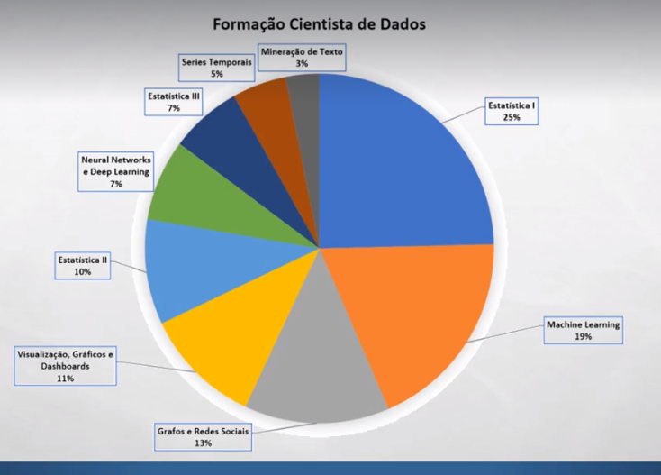

Estátistica
* Análise de dados exploratória.
* Identificar valores anormais.
* Produzir amotras
* Avaliar se diferenças são significantes
* Avaliar custo/benefício entre produtos
* Previsão de vendas.
* Resumo de dados.
* Produção de indicadores.
* Controle de qualidade.

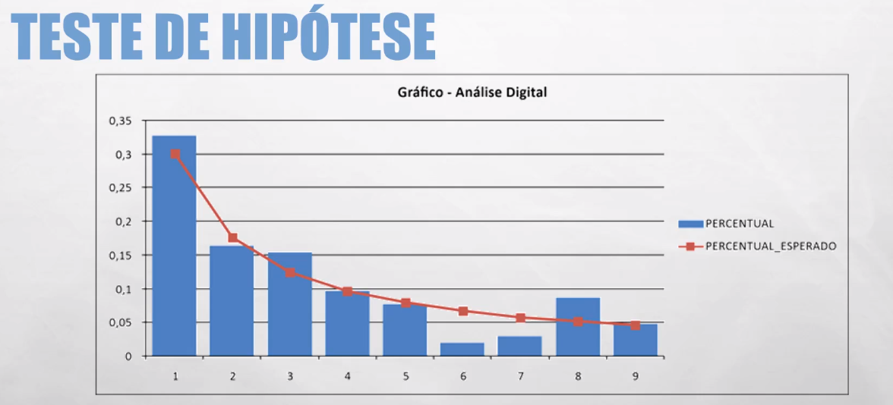

Séries temporais
* Prever a geração de energia em usina eólicas.
* Analisar o comportamento das ações na bolsa de valores.
* Analisar efeitos sazonais (vendas de casacos no inverno).
* Buscar padrões no comportamento de consumidores.
* Controle de qualidade em linhas de produção.

Machine Learning
* Quais clientes vão atender quais promoções?
* Previsão de fraudes.
* Churn Analysis: Quais clientes tendem a abandonar a empresa?
* Qual o perfil de funcionários que abandonarão o emprego e quando?

Neural Networks e Deep Learning
* Reconhecimento de imagens e padrões.
* Reconhecimento de fala.
* Analise de comportamento em tempo real.
* Tradução.
* Agentes em jogos.
* Carros autônomos.

Grafos
* Encontrar rotas mais curtas.
* Estudo da estrutura de linguagem.
* Estudo da disseminação de doenças.
* Analises de redes ele´tricas ou lógicas, buscando pontos fracos.

Mineração de Texto
* Classificação de spam.
* Anãlise de sentimentos.
* Classificação de documentos.
* Processamento de linguagem natural.
* Prevenção de crimes cibernéticos.

Visualização, Gráficos e Dashboards
* Análise de dados exploratória.
* Analise de Performance (KPI).
* Toda forma de produção final de resultados de processos de análise de dados.


-------------------------------------------------------------------------------------------------
<h1>Seção 02 - Estatística I</h1>

<h2>Conceitos Geráis</h2>

Estatística:
- Ciência que usa de teorias em experimentos e observações para o estudo destes.
	- Descritiva: Organizar, Demonstrar e Resumir Dados.
	- Probabilidade: Analisar situações sujeitas ao acaso.
	- Inferência: Obter respostas sobre um fenômeno com dados representativos.

Observação e experimento:
- Observação: Estudo em que os elementos analisados não são afetados (pesquisa).
	Ex: Pesquisa de intenção de votos.
- Experimentos: Condições ou tratamentos são impostas a grupos, para avaliar o resultado.
	Ex: Interfere nas condições.

Variáveis:
- Quantitativa - Numéricas
	- Contínuas: Valores reais, podem assumir qualquer intervalo.
	- Discretas: Números fixos, inteiro e num intervalo.
- Qualitativas - Categóricas
	- Nominais: Categorias sem hierarquia. Ex: Estado - SP, RS, RJ
	- Ordinais: Categorias com hierarquia. Ex: Baixo, Médio, Alto.

Estatística depende:
- Interpretação.
- Escolhas.
- Avaliação.


<h2>Amostragem</h2>

Amostra
- Parte de uma população, selecionada usando alguma técnica que de chances iguais a todos os elementos da população de serem selecionados.
	- População é todo o conjunto de elementos que está sendo estudado ou pesquisado.

Conceitos
	- População: Alvo de estudo.<br/>
	- Amostra: subconjunto da população.<br/>
	- Censo: Pesquisa com toda a população.
		- Alguns casos é utilizado.

Amostra é diferente de população.

Porque Amostra?
- Pode ser caro ou impossível inferir sobre toda a população (censo).

É possível inferir sobre uma amostra
* Uma amostra feita corretamente deve representar as mesmas características da população de onde foi retirada.
* Se ela não representa a população, dizemos que ela é enviesada.

Enviesamento
* Você subestima ou superestima o parâmetro da população. Resultados acima ou abaixo do esperado.
* Causas:
	* Pesquisa de pessoas próximas ou de fácil acesso.
	* Pesquisas pela Internet.
	* Sem uso de mecanismo de seleção aleatório.

"Custo" da Amostra:
* Margem de Erro e Nível de Confiança.
* Variação: Amostrar diferentes podem apresentar resultados diferentes.
* Podemos "medir" a variação esperada.

Amostra??
* Custo/benefício - 
	- As vezes com uma proporção menor, é conseguido um resultado melhor.
	- Vai necessitar de técnicas de amostragem mesmo se trabalhar com toda população.
* Separação da população para teste/treino/validação.
	- Necessário fazer alguma técnica.
* Experimentos diferentes.


Principais tipos de amostras
* Aleatória Simples.
* Estratificada.
* Sistemática.
* Por Unidade Monetária.


Amostras Aleatórias Simples
* Um determinado número de elementos é retirado da população de forma aleatória.
* Todos os elementos da população alvo do processo de amostragem, devem ter as mesmas chances de serem selecionados para fazer parte da amostra.


Duas formas de se trabalhar com Amostras Aleatórias Simples
* Com reposição.
	- Continua sendo parte da população e poderá ser selecionado novamente.
	- Utilização: Olimpiada de jogadores para fazer exame anti-dopping, se eles não puderem ser sorteados de novo, eles estariam livres para fazerem a utilização, por conta disso eles podem ser selecionados de novo.

* Sem reposição.
	- Não faz parte da população e não poderá ser selecionado novamente.
	- Utilização: Opinião de pesquisa de votos, onde só contará apenas uma vez.


Amostra Estratificada
* As vezes as populações estão divididas nos chamados estratos.
	- Separam grupos em categorias.


Amostra Sistemática
* Neste tipo de amostragem, é escolhido um elemento aleatório, e a partir daí, a cada N elementos um novo membro é escolhido.

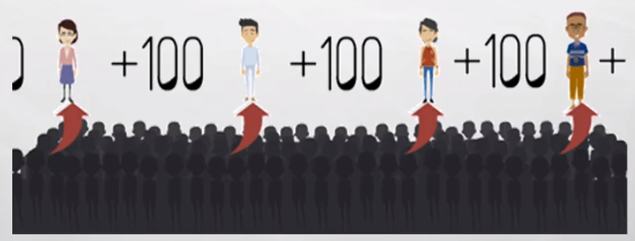

Amostragem por Unidade Monetária

* Total de Registros: 50
* Total de Débitos: 108.465,00
* Calcula o intervalo da amostra:
	* Valor Total/registros = 2.169.
* Ordena por Clientes.
* Seleciona um número aleatório entre 1 e 2.169.

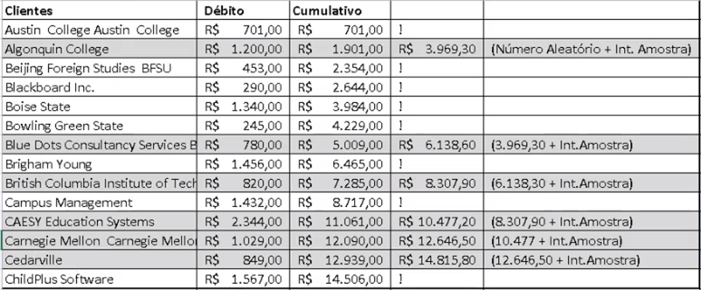

Funções no R
* sample()
	- Função utilizada para amostras simples.
* strata()
	- Função utilizada para amostras estatificada
* S.SY()
	- Gerar amostra sistemática.

<h2>Amostragem - Aula em R</h2>

```r

#DATASET FAMOSO QUE JÁ VEM COM O R
iris

dim(iris)

#PRIMEIRO PARÂMETRO DO SAMPLES É ONDE ELE VAI BUSCAR
#OS DADOS PARA GERAR A AMOSTRA
#VAI GERAR AMOSTRAS APENAS DE 0 OU 1
#SEGUNDO PARÂMETRO É QUANTAS AMOSTRAS EU QUERO GERAR
#QUE SÃO 150
#TERCEIRO PARÂMETRO SE PODE TER REPOSIÇÃO OU NÃO
#QUARTO PARÂEMTRO É A PROBABILIDADE DE GERAR CADA AMOSTRA.
#FOI FEITO A PROBABILIDADE IGUAL AOS DOIS VALORES

amostra = sample(c(0,1), 150, replace=TRUE, prob=c(0.5,0.5))

#QUANTIDADE DE AMOSTRAS COM O VALOR = 1
length(amostra[amostra==1])

#QUANTIDADE DE AMOSTRAS COM O VALOR = 0
length(amostra[amostra==0])

#SEMENTE DE ALEATÓRIEDADE QUE PODE REPETIR O EXPERIMENTO
set.seed(2345)

sample(c(100), 1)

```

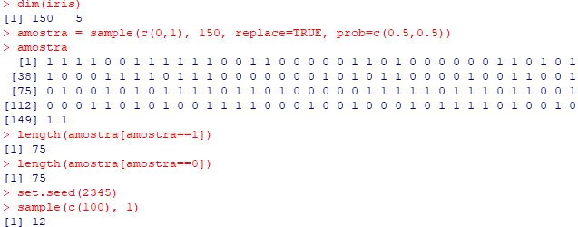


AMOSTRAGEM ESTRÁTIFICADA

```r

#APARECE INFORMAÇÕES MAIS DETALHADAS SOBRE O DATASET
summary(iris)

#INSTALA PACOTE
#install.packages("sampling")

#CARREGA O PACOTE
#library(sampling)

#GERA A AMOSTRA ESTRATIFICADA
#PRIMEIRO PARÂMETRO = DATASET
#SEGUNDO PARÂMETRO = COLUNA/S DESEJADA/S
#TERCEIRO PARÂMETRO = QUANTIDADE DE CADA SPECIE
amostrairis2 = strata(iris, c("Species"), size=c(25,25,25), method="srswor")


summary(amostrairis2)

#CONJUNTO DE DADOS QUE JÁ VEM NO R, SBORE INFERTILIDADE
infert

summary(infert)
120/248 * 100

amostra = strata(infert, c("education"), size=c(5,48,47), method="srswor")

summary(amostra)

```

AMOSTRAGEM SISTEMÁTICA

```r

#INSTALA O PACOTE
install.packages("TeachingSampling")
#USA A LIB
library(TeachingSampling)

#PRIMEIRO PARÂMETRO = TOTAL DA POPULAÇÃO
#SEGUNDO PARÂMETRO = É O INTERVALO DE QUAL IRÁ PULAR CADA AMOSTRA
amostra = S.SY(150, 10)

amostrairis = iris[amostra]

amostrairis

```


<h2>Medias de Centralidade e Variabilidade</h2>

Centralidade
* Média.
* Moda.
* Mediana.

Média:

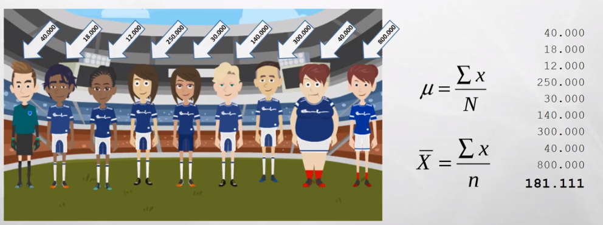

Moda:
* Valor mais frequente

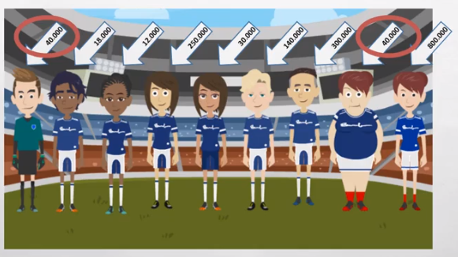

Mediana
* Valor do meio.
* Ordena-se os valores em ordem crescente.
* Se a quantidade for par, a mediana será a média dos valores nas posições n/2 e n/2+1.
* Se a quantidade for impar, a mediana será o valor na posição (n+1)/2.

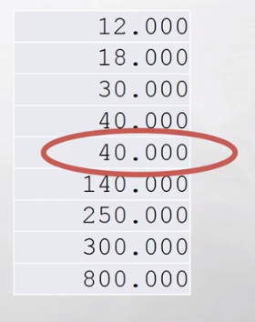

Media VS Mediana

* 10, 20, 30, 40, 10000

Média: 2020
Mediana: 30

- O mesmo conjunto de dados, há uma grande diferença entre as duas. A mediana não é influênciada pelos valores dos quartis, igual a média que é.

<h2>Medidas de Centralidade e Variabilidade - Parte II</h2>

Variabilidade
* Variância.
* Desvio Padrão.
* Amplitude.
* Não Centrais: Quartis.


Viariância:
* Mostra a regularidade do número de dados em relação a média.
* Variância e o Desvio Padrão se relacionam.

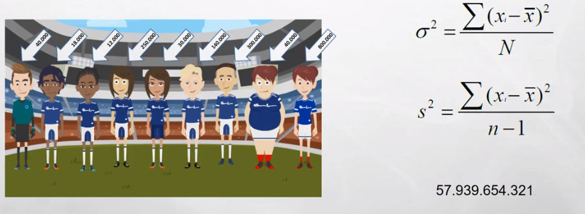

Desvio Padrão:
* Distância que os dados estão da média.
* É a mesma formúla da Variância só que é necessário tirar a raiz quadrada.

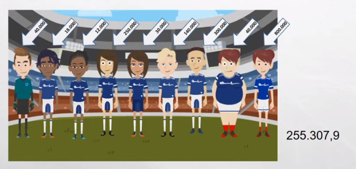

Amplitude:
* Diferença entre o maior e o menor.

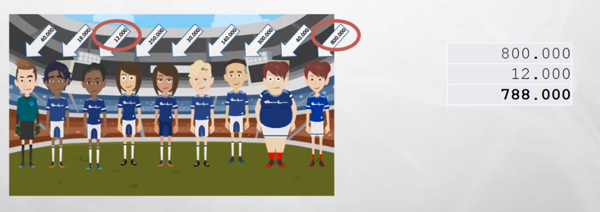

Medidas não centrais:
* Quartis
	* Q1: 25% dos menores valores - 30.000
	* Q2: 50%, igual a mediana. - 40.000
	* Q3: 75% dos maiores valores. - 250.000

Resumo do salário do time de futebol.

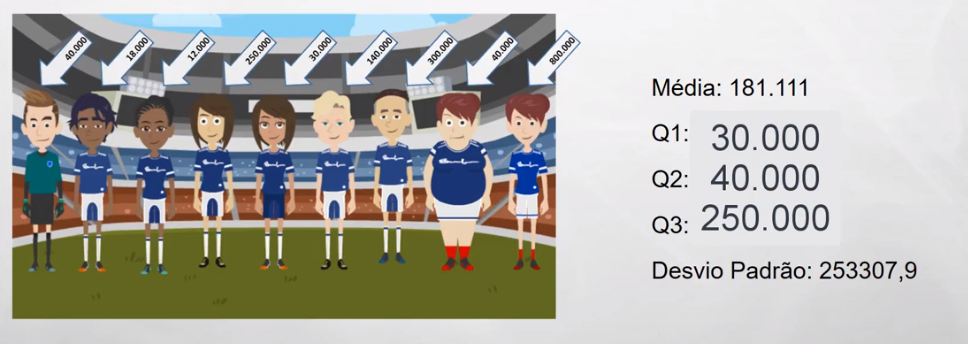

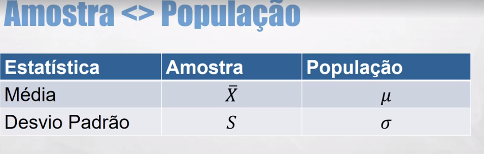

Funções no R

```r
#CALCULAR QUARTIS
quantile()

#DESVIO PADRÃO (STANDARD DESVIATION)
sd()

#VARIÂNCIA
var()

#MÉDIA
mean()

#MEDIANA
median()

```

Utilizando o R:
```r

jogadores = c(40000, 18000, 12000, 250000, 30000, 140000, 300000, 40000, 800000)

#MÉDIA DO SALÁRIO DOS JOGADORES
mean(jogadores)

#MEDIANA
median(jogadores)

#QUARTIS
quartis = quantile(jogadores)

quartis
quartis[4]

#DESVIO PADRÃO (STANDARD DEVIATION)
sd(jogadores)

summary(jogadores)


```

<h2>Usando a Estatística a seu favor</h2>


* Como a média é sensível a outliers, você pode dizer que o valor do mercado é diferente dependendo se você pega o valor da mediana ou da média.


<h2>Probabilidade</h2>

* Probabilidade (P): 0 <= P <= 1
* P = 1: Evento certo.
* P = 0: Evento impossível.
* Probabilidade de 50%: 0,5 / 1/2
* Impossível: -0,5 / -20% / 2/1


Conceitos
* Experimento: o que está sendo estudado.
* Espaço Amostral: todas as possibilidades de ocorrência do evento.
* Evento: resultados ocorridos
* Exemplo:
	* Experimento: jogar moeda.
	* Espaço Amostral: Cara ou Coroa.
	* Evento: Coroa.

* Eventos Excludentes: quando não podem ocorrer ao mesmo tempo.
	* Exemplo: Jogar um dado e ser 1 e par.

* Eventos Não Excludentes: quando podem ocorrer ao mesmo tempo.
	* Exemplo: jogar um dado e ser 2 e par.

* Eventos Dependentes: A ocorrência de um evento afeta o outro. Um tem que ocorrer para depois que o outro ocorra.
* Evento Independentes: A ocorrência de um evento não afeta o outro.

Um único evento

			Ocorrência Esperada
  P(Probabilidade)  =	-------------------
			Numero de Eventos Possíveis

Exemplo:
Jogar uma moeda e dar cara: P = 1/2, P =0,5 ou 50%
Jogar moeda = Experimento.
Dar cara = evento.

Jogar um dado e dar 6: P = 1/6, P = 0,16 ou 16%.

Eventos Exludentes
* Soma-se as probabilidades:
	* Jogar um dado e ser 1 ou par: 1/6 + 3/6 = 4/6 = 0,66


Eventos Não-excludentes
* Soma-se as probabilidades, diminui-se as sobreposições
	* Jogar um dado e ser 2 ou par: 1/6 + 3/6 - 1/6 = 3/6 = 0,5

Eventos Independentes
* Mais de um evento, como eles se relacionam?
	* Multiplicação.

* Qual a probabilidade de jogar dois dados, e dar 1 e 6: (dois eventos independentes)
	* 1/6 * 1/6 = 1/36 = 0,027

Eventos dependentes
* Com 6 cartas na mão (A,2,3,4,5,6), qual a probabilidade de primeiro evento tirar A e no segundo evento tirar 4?
1/6 * 1/5 = 1/30 = 0,033

Probabilidade a "longo prazo"
*Jogando um dados "justo" 6 vezes, qual a média esperada?
	* 1 + 2 + 3 + 4 + 5 + 6 / 6 = 3,5

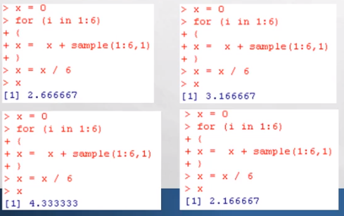

* Como são poucas vezes que o dado será jogado, o valor da média de dispersa muito, por conta disso uma simulação jogando mais vezes é feita, não tendo esse valor dispersado.
* Quando temos muitos eventos (mais dados), tendemos a encontrar a probabilidade que esperávamos. Por conta disso, a probabilidade é algo que se estuda a longo prazo.

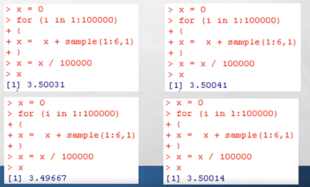


<h2>Entendo Distribuição</h2>

* Usado principalmente na teoria da probabilidade.
* Comportamento de dados aleatórios.

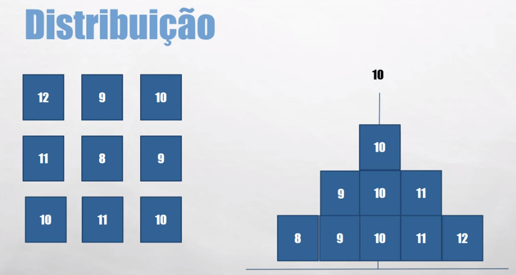

Não é o caso da imagem:
* 68% estão a +- 1 Desvio Padrão da Média.
* 30% estão a +- 2 Desvio Padrão da Média.
* Etc...


- O dado tem um determinado perfil, e tendo esse perfil é possível aplicar técnicas estátisticas iguais para todos os dados.

<h2>Distribuição Binomial</h2>

O que é?
* Distribuição de Probabilidade Discreta.
* Probabilidade da ocorrência de evento, desde que sejam eventos discretos e determinados pré-requisitos sejam atendidos.

Pré-requisitos
* Número Fixo de Experimentos.
* Cada experimento pode ter 2 resultados apenas: sucesso ou fracasso.
* A probabilidade de sucesso deve ser a mesma em cada experimento.
* Os experimentos são independentes.

Exemplo:
* Se eu jogar uma moeda 5 vezes. Qual a probabilidade de dar cara 3 vezes?

* Número Fixo de Experimentos? 5 vezes
* Cada experimento pode ter 2 resultados apenas: sucesso ou fracasso? Cara ou coroa.
* A probabilidade de sucesso deve ser a mesma em cada experimento? Sim.
* Os experimentos são independentes? Sim.

Exemplo:
* Um cesto tem 10 frutas que pesam entre 3 e 5 quilos. Qual a probabilidade de eu retirar duas frutas, uma de 4 quilos e outra de 3 quilos?

* Número Fixo de Experimentos? Sim.
* Cada experimento pode ter 2 resultados apenas: sucesso ou fracasso? Não.
* A probabilidade de sucesso deve ser a mesma em cada experimento? Não.
* Os experimentos são independentes? Não.

Convenções
* X = Total de sucesso esperado do experimento.
* p = Probabilidade de sucesso.
* n = número de experimentos.

* 1-p = probabilidade de fracassos.

Fórmula para calcular a probabilidade de uma distribuição binomial:

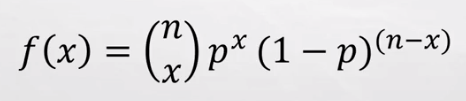
