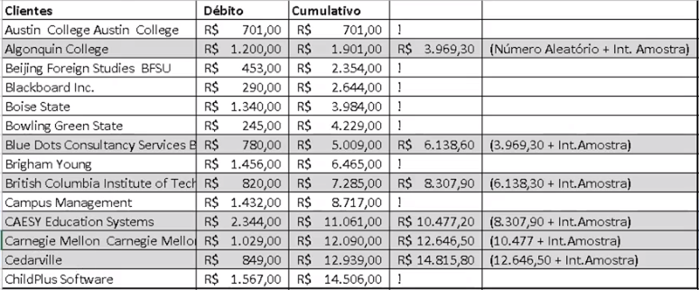
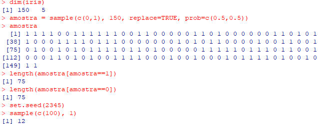
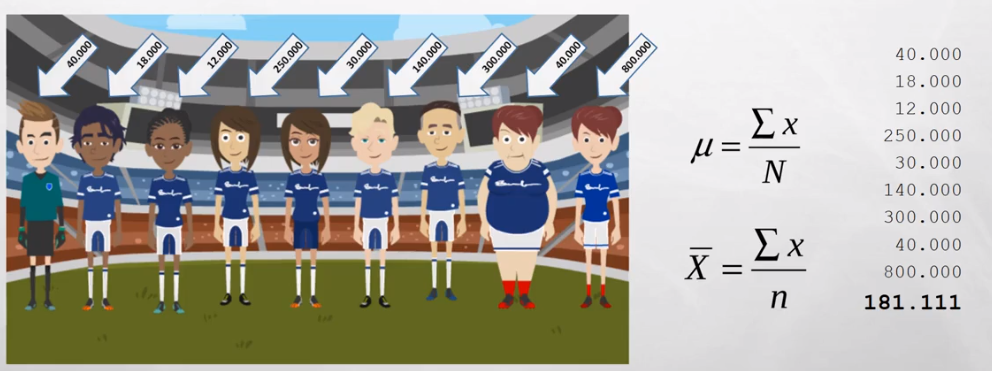
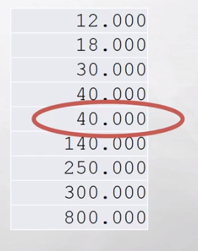
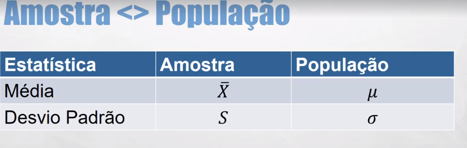
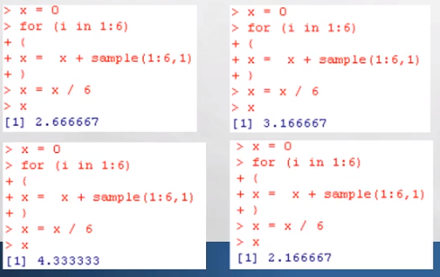
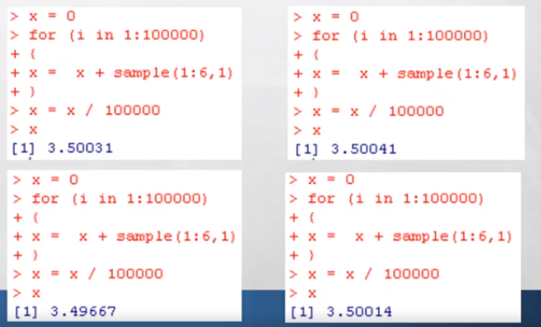
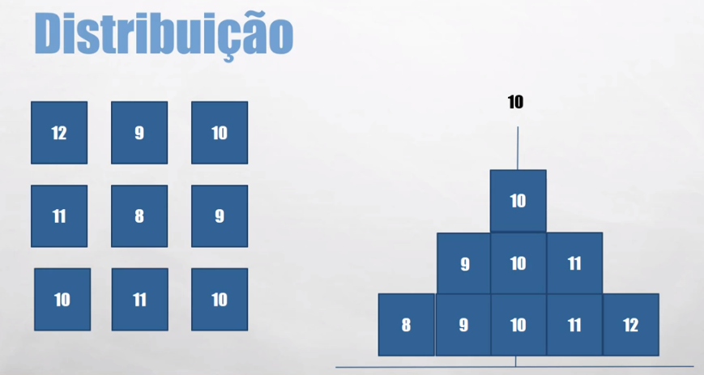
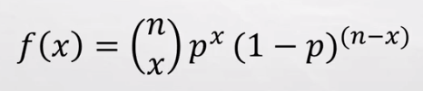

-------------------------------------------------------------------------------------------------
<h1>Seção 02 - Estatística I</h1>

<h2>Conceitos Geráis</h2>

Estatística:
- Ciência que usa de teorias em experimentos e observações para o estudo destes.
	- Descritiva: Organizar, Demonstrar e Resumir Dados.
	- Probabilidade: Analisar situações sujeitas ao acaso.
	- Inferência: Obter respostas sobre um fenômeno com dados representativos.

Observação e experimento:
- Observação: Estudo em que os elementos analisados não são afetados (pesquisa).
	Ex: Pesquisa de intenção de votos.
- Experimentos: Condições ou tratamentos são impostas a grupos, para avaliar o resultado.
	Ex: Interfere nas condições.

Variáveis:
- Quantitativa - Numéricas
	- Contínuas: Valores reais, podem assumir qualquer intervalo.
	- Discretas: Números fixos, inteiro e num intervalo.
- Qualitativas - Categóricas
	- Nominais: Categorias sem hierarquia. Ex: Estado - SP, RS, RJ
	- Ordinais: Categorias com hierarquia. Ex: Baixo, Médio, Alto.

Estatística depende:
- Interpretação.
- Escolhas.
- Avaliação.


<h2>Amostragem</h2>

Amostra
- Parte de uma população, selecionada usando alguma técnica que de chances iguais a todos os elementos da população de serem selecionados.
	- População é todo o conjunto de elementos que está sendo estudado ou pesquisado.

Conceitos
	- População: Alvo de estudo.<br/>
	- Amostra: subconjunto da população.<br/>
	- Censo: Pesquisa com toda a população.
		- Alguns casos é utilizado.

Amostra é diferente de população.

Porque Amostra?
- Pode ser caro ou impossível inferir sobre toda a população (censo).

É possível inferir sobre uma amostra
* Uma amostra feita corretamente deve representar as mesmas características da população de onde foi retirada.
* Se ela não representa a população, dizemos que ela é enviesada.

Enviesamento
* Você subestima ou superestima o parâmetro da população. Resultados acima ou abaixo do esperado.
* Causas:
	* Pesquisa de pessoas próximas ou de fácil acesso.
	* Pesquisas pela Internet.
	* Sem uso de mecanismo de seleção aleatório.

"Custo" da Amostra:
* Margem de Erro e Nível de Confiança.
* Variação: Amostrar diferentes podem apresentar resultados diferentes.
* Podemos "medir" a variação esperada.

Amostra??
* Custo/benefício - 
	- As vezes com uma proporção menor, é conseguido um resultado melhor.
	- Vai necessitar de técnicas de amostragem mesmo se trabalhar com toda população.
* Separação da população para teste/treino/validação.
	- Necessário fazer alguma técnica.
* Experimentos diferentes.


Principais tipos de amostras
* Aleatória Simples.
* Estratificada.
* Sistemática.
* Por Unidade Monetária.


Amostras Aleatórias Simples
* Um determinado número de elementos é retirado da população de forma aleatória.
* Todos os elementos da população alvo do processo de amostragem, devem ter as mesmas chances de serem selecionados para fazer parte da amostra.


Duas formas de se trabalhar com Amostras Aleatórias Simples
* Com reposição.
	- Continua sendo parte da população e poderá ser selecionado novamente.
	- Utilização: Olimpiada de jogadores para fazer exame anti-dopping, se eles não puderem ser sorteados de novo, eles estariam livres para fazerem a utilização, por conta disso eles podem ser selecionados de novo.

* Sem reposição.
	- Não faz parte da população e não poderá ser selecionado novamente.
	- Utilização: Opinião de pesquisa de votos, onde só contará apenas uma vez.


Amostra Estratificada
* As vezes as populações estão divididas nos chamados estratos.
	- Separam grupos em categorias.


Amostra Sistemática
* Neste tipo de amostragem, é escolhido um elemento aleatório, e a partir daí, a cada N elementos um novo membro é escolhido.


Amostragem por Unidade Monetária

* Total de Registros: 50
* Total de Débitos: 108.465,00
* Calcula o intervalo da amostra:
	* Valor Total/registros = 2.169.
* Ordena por Clientes.
* Seleciona um número aleatório entre 1 e 2.169.



Funções no R
* sample()
	- Função utilizada para amostras simples.
* strata()
	- Função utilizada para amostras estatificada
* S.SY()
	- Gerar amostra sistemática.

<h2>Amostragem - Aula em R</h2>

```r

#DATASET FAMOSO QUE JÁ VEM COM O R
iris

dim(iris)

#PRIMEIRO PARÂMETRO DO SAMPLES É ONDE ELE VAI BUSCAR
#OS DADOS PARA GERAR A AMOSTRA
#VAI GERAR AMOSTRAS APENAS DE 0 OU 1
#SEGUNDO PARÂMETRO É QUANTAS AMOSTRAS EU QUERO GERAR
#QUE SÃO 150
#TERCEIRO PARÂMETRO SE PODE TER REPOSIÇÃO OU NÃO
#QUARTO PARÂEMTRO É A PROBABILIDADE DE GERAR CADA AMOSTRA.
#FOI FEITO A PROBABILIDADE IGUAL AOS DOIS VALORES

amostra = sample(c(0,1), 150, replace=TRUE, prob=c(0.5,0.5))

#QUANTIDADE DE AMOSTRAS COM O VALOR = 1
length(amostra[amostra==1])

#QUANTIDADE DE AMOSTRAS COM O VALOR = 0
length(amostra[amostra==0])

#SEMENTE DE ALEATÓRIEDADE QUE PODE REPETIR O EXPERIMENTO
set.seed(2345)

sample(c(100), 1)

```




AMOSTRAGEM ESTRÁTIFICADA

```r

#APARECE INFORMAÇÕES MAIS DETALHADAS SOBRE O DATASET
summary(iris)

#INSTALA PACOTE
#install.packages("sampling")

#CARREGA O PACOTE
#library(sampling)

#GERA A AMOSTRA ESTRATIFICADA
#PRIMEIRO PARÂMETRO = DATASET
#SEGUNDO PARÂMETRO = COLUNA/S DESEJADA/S
#TERCEIRO PARÂMETRO = QUANTIDADE DE CADA SPECIE
amostrairis2 = strata(iris, c("Species"), size=c(25,25,25), method="srswor")


summary(amostrairis2)

#CONJUNTO DE DADOS QUE JÁ VEM NO R, SBORE INFERTILIDADE
infert

summary(infert)
120/248 * 100

amostra = strata(infert, c("education"), size=c(5,48,47), method="srswor")

summary(amostra)

```

AMOSTRAGEM SISTEMÁTICA

```r

#INSTALA O PACOTE
install.packages("TeachingSampling")
#USA A LIB
library(TeachingSampling)

#PRIMEIRO PARÂMETRO = TOTAL DA POPULAÇÃO
#SEGUNDO PARÂMETRO = É O INTERVALO DE QUAL IRÁ PULAR CADA AMOSTRA
amostra = S.SY(150, 10)

amostrairis = iris[amostra]

amostrairis

```


<h2>Medias de Centralidade e Variabilidade</h2>

Centralidade
* Média.
* Moda.
* Mediana.

Média:



Moda:
* Valor mais frequente


Mediana
* Valor do meio.
* Ordena-se os valores em ordem crescente.
* Se a quantidade for par, a mediana será a média dos valores nas posições n/2 e n/2+1.
* Se a quantidade for impar, a mediana será o valor na posição (n+1)/2.



Media VS Mediana

* 10, 20, 30, 40, 10000

Média: 2020
Mediana: 30

- O mesmo conjunto de dados, há uma grande diferença entre as duas. A mediana não é influênciada pelos valores dos quartis, igual a média que é.

<h2>Medidas de Centralidade e Variabilidade - Parte II</h2>

Variabilidade
* Variância.
* Desvio Padrão.
* Amplitude.
* Não Centrais: Quartis.


Viariância:
* Mostra a regularidade do número de dados em relação a média.
* Variância e o Desvio Padrão se relacionam.


Desvio Padrão:
* Distância que os dados estão da média.
* É a mesma formúla da Variância só que é necessário tirar a raiz quadrada.


Amplitude:
* Diferença entre o maior e o menor.


Medidas não centrais:
* Quartis
	* Q1: 25% dos menores valores - 30.000
	* Q2: 50%, igual a mediana. - 40.000
	* Q3: 75% dos maiores valores. - 250.000

Resumo do salário do time de futebol.




Funções no R

```r
#CALCULAR QUARTIS
quantile()

#DESVIO PADRÃO (STANDARD DESVIATION)
sd()

#VARIÂNCIA
var()

#MÉDIA
mean()

#MEDIANA
median()

```

Utilizando o R:
```r

jogadores = c(40000, 18000, 12000, 250000, 30000, 140000, 300000, 40000, 800000)

#MÉDIA DO SALÁRIO DOS JOGADORES
mean(jogadores)

#MEDIANA
median(jogadores)

#QUARTIS
quartis = quantile(jogadores)

quartis
quartis[4]

#DESVIO PADRÃO (STANDARD DEVIATION)
sd(jogadores)

summary(jogadores)


```

<h2>Usando a Estatística a seu favor</h2>


* Como a média é sensível a outliers, você pode dizer que o valor do mercado é diferente dependendo se você pega o valor da mediana ou da média.


<h2>Probabilidade</h2>

* Probabilidade (P): 0 <= P <= 1
* P = 1: Evento certo.
* P = 0: Evento impossível.
* Probabilidade de 50%: 0,5 / 1/2
* Impossível: -0,5 / -20% / 2/1


Conceitos
* Experimento: o que está sendo estudado.
* Espaço Amostral: todas as possibilidades de ocorrência do evento.
* Evento: resultados ocorridos
* Exemplo:
	* Experimento: jogar moeda.
	* Espaço Amostral: Cara ou Coroa.
	* Evento: Coroa.

* Eventos Excludentes: quando não podem ocorrer ao mesmo tempo.
	* Exemplo: Jogar um dado e ser 1 e par.

* Eventos Não Excludentes: quando podem ocorrer ao mesmo tempo.
	* Exemplo: jogar um dado e ser 2 e par.

* Eventos Dependentes: A ocorrência de um evento afeta o outro. Um tem que ocorrer para depois que o outro ocorra.
* Evento Independentes: A ocorrência de um evento não afeta o outro.

Um único evento

			Ocorrência Esperada
  P(Probabilidade)  =	-------------------
			Numero de Eventos Possíveis

Exemplo:
Jogar uma moeda e dar cara: P = 1/2, P =0,5 ou 50%
Jogar moeda = Experimento.
Dar cara = evento.

Jogar um dado e dar 6: P = 1/6, P = 0,16 ou 16%.

Eventos Exludentes
* Soma-se as probabilidades:
	* Jogar um dado e ser 1 ou par: 1/6 + 3/6 = 4/6 = 0,66


Eventos Não-excludentes
* Soma-se as probabilidades, diminui-se as sobreposições
	* Jogar um dado e ser 2 ou par: 1/6 + 3/6 - 1/6 = 3/6 = 0,5

Eventos Independentes
* Mais de um evento, como eles se relacionam?
	* Multiplicação.

* Qual a probabilidade de jogar dois dados, e dar 1 e 6: (dois eventos independentes)
	* 1/6 * 1/6 = 1/36 = 0,027

Eventos dependentes
* Com 6 cartas na mão (A,2,3,4,5,6), qual a probabilidade de primeiro evento tirar A e no segundo evento tirar 4?
1/6 * 1/5 = 1/30 = 0,033

Probabilidade a "longo prazo"
*Jogando um dados "justo" 6 vezes, qual a média esperada?
	* 1 + 2 + 3 + 4 + 5 + 6 / 6 = 3,5



* Como são poucas vezes que o dado será jogado, o valor da média de dispersa muito, por conta disso uma simulação jogando mais vezes é feita, não tendo esse valor dispersado.
* Quando temos muitos eventos (mais dados), tendemos a encontrar a probabilidade que esperávamos. Por conta disso, a probabilidade é algo que se estuda a longo prazo.




<h2>Entendo Distribuição</h2>

* Usado principalmente na teoria da probabilidade.
* Comportamento de dados aleatórios.



Não é o caso da imagem:
* 68% estão a +- 1 Desvio Padrão da Média.
* 30% estão a +- 2 Desvio Padrão da Média.
* Etc...


- O dado tem um determinado perfil, e tendo esse perfil é possível aplicar técnicas estátisticas iguais para todos os dados.

<h2>Distribuição Binomial</h2>

O que é?
* Distribuição de Probabilidade Discreta.
* Probabilidade da ocorrência de evento, desde que sejam eventos discretos e determinados pré-requisitos sejam atendidos.

Pré-requisitos
* Número Fixo de Experimentos.
* Cada experimento pode ter 2 resultados apenas: sucesso ou fracasso.
* A probabilidade de sucesso deve ser a mesma em cada experimento.
* Os experimentos são independentes.

Exemplo:
* Se eu jogar uma moeda 5 vezes. Qual a probabilidade de dar cara 3 vezes?

* Número Fixo de Experimentos? 5 vezes
* Cada experimento pode ter 2 resultados apenas: sucesso ou fracasso? Cara ou coroa.
* A probabilidade de sucesso deve ser a mesma em cada experimento? Sim.
* Os experimentos são independentes? Sim.

Exemplo:
* Um cesto tem 10 frutas que pesam entre 3 e 5 quilos. Qual a probabilidade de eu retirar duas frutas, uma de 4 quilos e outra de 3 quilos?

* Número Fixo de Experimentos? Sim.
* Cada experimento pode ter 2 resultados apenas: sucesso ou fracasso? Não.
* A probabilidade de sucesso deve ser a mesma em cada experimento? Não.
* Os experimentos são independentes? Não.

Convenções
* X = Total de sucesso esperado do experimento.
* p = Probabilidade de sucesso.
* n = número de experimentos.
* 1-p = probabilidade de fracassos.

Fórmula para calcular a probabilidade de uma distribuição binomial:



Exemplo:

* Se eu jogar uma moeda 5 vezes. Qual a probabilidade de dar cara 3 vezes?
* X = 3.
* p = 0,5.
* n = 5.


Exemplo: Se eu passar 4 sinais de quatro tempos cada. Qual a probabilidade de eu pegar 0, 1, 2, 3 e 4 sinais verdes?

* P(0) = Probabilidade de encontrar nenhum sinal vermelho = 0,316406.
* P(1) = Probabilidade de encontrar 1 sinal verde = 0,421875.
* P(2) = 0,210938.
* P(3) = 0,046875.
* P(4) = 0,003906.
A soma de todas as probabilidades possíveis (estudando as probabilidades de todo o espaço amostral) é igual a 1.

Exemplo:

Se você fizer a prova de um concurso com 12 questões. "Chutando" todas as questões, qual a probabilidade de acertar 7 questões? (4 alternativas cada questão).
X = 7 certos.
p = 0,25.
n = 12.


 

É possível tanto resolver o problema através do cálculo como na imagem acima como através de uma tabela de distribuição binomial.


Distribuição Binomial ou Cálculo "Manual"?

* Qual a probabilidae de passar em dois sinais de dois tempo e os dois estarem verdes?
* Fazendo manualmente: 1/2 * 1/2 = 0,25.
* Executando a distribuição binomial no R.
```r
dbinom(2,2,0.5)
```
[1] 0.25

<h2>No R</h2>

```r
#SE JOGAR MOEDA 5 VEZES QUAL A PROBABILIDADE DE DAR CARA 3 VEZES
#PRIMEIRO PARÂMETRO É O X
#SEGUNDO PARÂMETRO É O n
#TECEIRO PARÂMETRO É O p
dbinom(3, 5, 0.5)

#4 SENAIS DE 4 TEMPOS, PROBABILIDADE DE PEGAR 0, 1, 2, 3, 4 SINAIS VERDES
dbinom(0, 4, 0.25)
dbinom(1, 4, 0.25)
dbinom(2, 4, 0.25)
dbinom(3, 4, 0.25)
dbinom(4, 4, 0.25)

#CALCULA A PROBABILIDADE DE TODO O ESTAPÇO AMOSTRAL
pbinom(4, 4, 0.25)

#PROVA CONCURSO DE 12 QUESTÕES. ACERTAR 7 QUESTÕES E CADA QUESTÕES TEM 4 ALTERNATIVAS
dbinom(7, 12, 0.25)
```


<h2>Distribuição Normal</h2>

* Distribuição Simétrica.
* Distribuição em que a média dos dados se encontram ao centro.
* Encontrar relativamente a mesma quantidade de dados acima e abaixo do média


Teorema Central do Limite
* Conforme o tamanho da amostra aumenta, a distribuição das médias amostrais se aproxima cada vez mais da distribuição normal.
* Independente de como os dados estão distribuídos, suas médias estaão normalmente distribuídas.

Distribuição Normal Padrao [Z]
* Mostra o número de desvios padrões que o valor está acima ou abaixo da média (score z ou valor z).
* Média Zero.
* Desvio Padrão 1.
* Usa-se uma fórmula para calcular a probabilidade de seus dados com relação a tabela Z.


Exemplo de cálculo com distribuição normal.
* Existe um conjunto de objetos em uma cesta, cujos pesos são normalmente distribuídos com média = 8 e desvio padrão igual a 2.
* 1 - Qual a chance de se tirar um objeto pesando menos de 6 quilos?

Primeiro calcula-se o Z e depois é verificado na tabela de distribuição normal.


15,8%

Outro exemplo:
* Existe um conjunto de objetos em uma cesta, cujos pesos são normalmente distribuídos com média = 8 e desvio padrão igual a 2.
* 2 - Qual a chance de se tirar um objeto pesando mais de 8 quilos?
50%


* 3 - Qual a chance de tirar um objeto com mais de 10 quilos?


* 4 - Qual a chance de se tirar um objeto que tenha menos de 10 quilos e mais de 8 quilos?


* 5 - Qual a chance de se tirar um objeto que tenha menos de 6 quilos ou mais de 10 quilos?


* 6 - Qual a chance de se tirar um objeto que tenha menos de 4,3 quilos?


Distribuição Normal no R
```r
#SE A DISTRIBUIÇÃO FOR MENOR QUE A MÉDIA P[X<x]
pnorm()
#SE MAIOR P[X>x] SÓ INSERIR O PARÂMETRO lower.tail = FALSE

qnorm()

```

Como saber se a Distribuição dos dados é Normal?
* Forma mais simples e mais rápida é gerar um Histograma.


Outra forma:
* Gerar um Diagrama de Probabilidade Normal.


Teste de Shapiro-Wilk
* Teste de Hipótese.
* HO = Dados estão normalmente distribuídos.
* Alfa = 0,05 (Normalmente utilizado).
* Valor de p <= 0,05: rejeita hipótese nula.
* Valor de p> 0,05: Não é possível rejeitar a hipótese nula

* p-value = 0.001722 [p <= 0,05] - "não normal"
* p-value = 0.05696 [p > 0,05] - "normal"


Qual rigor?
* Nem sempre os dados precisam ser rigorosamente normais. Dados aproximadamente normais são suficientes para a maioria dos casos.

R
```r
#GERA NÚMEROS ALEATÓRIOS NORMAIS DISTRIBUIDOS
x = rnorm[100]
#GERA O TESTE DE NORMALIDADE
qqnorm[x]
#GERA A LINHA DE MELHOR AJUSTE
qqline[x]
#EXECUTA O TESTE PARA VERIFICAR SE OS DADOS ESTÃO NORMAIS E PEGAR O VALOR DE P E COMPARAR COM O ALFA
shapiro.test[x]

```

<h2>Distribuição Normal no R</h2>

```r
#MÉDIA = 8 DESVIO PADRÃO = 2. TIRAR OBJETO < 6
#QUAL OBJETO TIRAR, MÉDIA E DESIVIO PADRÃO (ORDEM DOS PARÂMETROS)
pnorm(6, 8, 2)

#MEDIA = 8 DESVIO PADRÃO = 2 OBJETO > 6
pnorm(6, 8, 2, lower.tail=F)

#MESMO RESULTADO DO COMANDO ACIMA
1 - pnorm(6,8,2)

#MENOS 6 QUILOS OU MAIS DE 10 QUILOS
pnorm(6,8, 2) + pnorm(10, 8, 2, lower.tail=F)

#QUAL A CHANCE DE SE TIRAR UM OBJETO MENOS DE 10 KG E MAIS DE 8KG
pnorm(10, 8, 2) - pnorm(8,8,2)


#100 VARIÁVEIS ALEATÓRIAS
x = rnorm(100)

qqnorm(x)

qqline(x)

shapiro.test(x)

```


<h2>Estatística Paramétrica</h2>
* Requer que os dados estejam em conformidade com alguma distribuição.
* Ex: Distribuição Normal.

<h2>Estátistica Não-Paramétrica</h2>
* Quando os dados não estão com conformidade com alguma distribuição.
* Quando não se conhece a distribuição dos dados.

* A estatística paramétrica oferece menos riscos.
	* Por exemplo, se os dados estão normalmente distribuídos, um teste de hipótese paramétrico tende a ser mais preciso do que um teste não paramétrico.


<h2>Intervalos de Confiança</h2>
* É possível inferir características de uma população a partir de uma amostra.
* Porque?
	* Custo.
	* Viabilidade.
	* Etc.
* Preço: erro padrão / nível de confiança.
* Riscos: Dados ruins, enviesamento.

Porém...
* Como estamos utilizando amostra...devemos esperar variação.
* A primeira amostra pode variar com relação a segunda...
* A segunda com a relação a terceira etc
* Mas devemos poder "medir" o quanto pode ser esta variação.

Intervalos de Confiança
* É o parâmetro mais ou menos a margem de erro estimada.
* Parâmetro: valor a ser estimado.
* Margem de erro: Variabilidade, para mais ou para menos.
* Nível de Confiança: de 80% a 99%.
* Tamanho da Amostra (n).


Vai existir um percentual de confiança e seu respectivo valor de Z que será utilizado na fórmula.

Em números...
* Entre 63 e 67% dos entrevistados pretendem votar em Maria, com um nível de confiança de 95%.
* Parâmetro: Intenção de Voto (Proporção).
* Nível de Confiança: 95%.
* Intervalo de Confiança: Entre 63 e 67%.
* Erro padrão: 1,96.
* Entrevistados (n): 1000.
* Margem de Erro: +-2%.

Compensação:
* Nível de Confiança maior, maior Erro Padrão.
* Maior Tamnho da Amostra, Menor Erro Padrão.

Tipos de Intervalos de Confiança:
* Intervalo de Confiança para a média.
* Intervalo de Confiança para a proporção.

<h2>Intervalo de Confiança para a Média</h2>
* Queremos estimar o salário médio de um cientista de dados.
* 100 pesquisados (n).
* Intervalo de confiança: 95%.
* O desvio padrão é 1100,00.
* A média é de R$ 5.800,00.
* Valor de z* = 1,96.
* Margem de erro: +- 215,60.
* O salário médio de um cientista de dados é entre 5.584,40 e 6,015,60 com um nível de confiança de 95%.


Intervalo de Confiança para a Média, Aumentando o intervalo de Confiança
* Queremos estimar o salário médio de um cientista de dados.
* 100 pesquisados (n)
* Intervalo de confiança: 99% (era 95).
* O desvio padrão é 1100,00.
* A média é de R$ 5.800,00.
* Valor de z* = 2,58 (era 1,96).
* Margem de erro: +- 283,8.
* O salário médio de um cientista de dados é entre 5.516,20 e 6.083,80 com um nível de confiança de 99%.


Troca entre Margem de Erro, Intervalo de Confiança e Amostra
* Aumentando a margem de erro, é natural que as chances da minha amostra estarem dentro do intervalo, por isso eu tenho um intervalo de confiança maior.
* Da mesma forma, aumentando n, reduz a chance do efeito acaso, por isso minha margem de erro reduz.

Intervalo de Confiança para a Média:
Aumentando n - 
* Queremos estimar o salário médio dos cientistas de dados.
* 1000 pesquisados (n).
* Intervalo de confiança: 95%.
* O desvio padrão é 1100,00.
* A média é de R$ 5.800,00.
* Valor de z* = 1,96.
* Margem de erro: +-68,18.
* O salário médio de um cientista de dados é entre 5.731,82 e 5.868,18 com um nível de confiança de 95%.


<h2>Intervalo de Confiança para a Proporção</h2>
* Queremos estimar a proporção de eleitores que pretendem votar em Maria para prefeito.
* 1000 pesquisados (n).
* Intervalo de confiança: 95%.
* 650 Responde Maria. p = 650/1000 = 0,65.
* 330 Responde João. p = 330/1000 = 0,33.
* 20 Não sabe /Nenhum. p - 20/1000 = 0,02.
* Valor de z* = 1,96.

Entre 62 e 68% dos entrevistados pretendem votar em Maria, com um nível de confiança de 95%.


<h2>Testes de Hipótese</h2>
* Confirmar ou negar uma premissa usando uma amostra.
* Esta premissa usa um parâmetro, por exemplo:
	* 56% dos brasileiros não gostam de estatística.
* Encontrar diferença não é tudo, é preciso saber se esta diferença é estatisticamente significante.
* Só é feito por conta das amostras, pois se for feita com a população não haverá sentido.


Convensões:
* Score padrão: erros padrão que seus dados estão abaixo ou acima da média.
* A versão padronizada de sua estatística é chamada de "estatística de teste".
* Olha na versão padronizada de Z. se sua estatística de teste estiver próxima de zero ou num interevalo onde os resultados devem estar, então não se pode rejeitar H0.
* Se estiver próximo a cauda, então podemos rejeitar H0.

Alfa e valor-p


Etapas para se fazer um testes de Hipóteses:
1. Definir o tamanho da sua amostra.
2. Coletar dados.
3. Calcular a média e o desvio padrão.
4. Definir as duas hipóteses: H0 e Ha.
5. Definir seu alfa.
6. Padronizar seus dados gerando a estatística de teste.
7. Encontrar o valor-p na tabela Z.
8. Comparar com seu alfa.
9. Emitir seu veredito.


Erros cometidos em Testes de Hipótese:
* Erro do tipo 1: rejeitar H0 quando não deveria.
	* Chance de ocorrer igual a Alfa.
* Erro do tipo 2: Não rejeitar H0 quando deveria ter rejeitado.
	* Depende do tamanho da amostra.

* Ocorrem devido ao acaso.

Trocas


Ideal:
* Amostra grande.
* Alfa pequeno.

<h2>Distribuição T de Student</h2>
* Utilizada quando a amostra é pequena (menor que 30).
* E não se conhece o desvio padrão da população.
* Custo: Maior variabilidade (por exemplo, em um teste de hipótese).

* Tendência maior de encontrar valores nas caudas (caudas maiores).
* Se n >= 30, se assemelha a uma distribuição normal.

Grau de liberdade: corresponde ao tamanho da amostra (n-1)
Se n=15, t14

* Você pode usar T de Student para:
	* Calcular probabilidades.
	* Calcular Intervalos de Confiança.
	* Executar testes de Hipóteses.
* Calculamos o valor de t.
* Consultamos a tabela de distribuição t ou
* Usamos o R para calcular a probabilidade.


Alterando o exemplo:
Uma pesquisa mostra que cientistas de dados ganham R$ 75,00 por hora. Uma amostra de 9 cientistas é selecionado é perguntando o salário. O desvio padrão é 10. Qual a probabilidade do salário ser maior que R$ 80 a hora?

u0 = 75 (Média da população).
S = 10 (Desvio Padrão da amostra).
n = 9 (Tamanho da amostra).
t0 = 8 (Graus de liberdade).


Distribuição T de Student no R
```r
#P[X<x]
pt()
#P[X>x] = lower.tail=FALSE
```

Distribuição T de Student no R

```r
#Média = 75, AMOSTRA = 9 E DESVIO PADRÃO 10
# < 80  t = 1,5
#Segundo parâmetro = Graus de Liberdade
#8 pois amostra é 9, então n - 1
pt(1.5, 8)

pt(1.5, 8, lower.tail=F)

pt(1.5, 8) + pt(1.5, 8, lower.tail=F) # = 1
# > pt(1.5, 8)
# [1] 0.9139984
# > pt(1.4, 8, lower.tail=F)
# [1] 0.09953969
# > pt(1.5, 8, lower.tail=F)
# [1] 0.08600165
# > pt(1.5, 8) + pt(1.5, 8, lower.tail=F)
# [1] 1

```

<h2>Questionário Estatística I</h2>

* Pergunta 1:
	* Executando a função sample, como o código abaixo:
	* sample(2, 10, replace=F, prob=c(0.2,0.8))
	* obtemos um erro. Qual alternativa melhor explica o motivo de ter ocorrido o erro?
		* R: Estamos tentando gerar 10 números aleatórios de 2 números, sem reposição.

* Pergunta 2: 
	* Dado o conjunto de dados:
	* 22, 10, 12, 14, 13, 15.
	* Qual alternativa apresentta a reposta correta para a mediana destes dados?
		* R: 13.5
```r
x = c(22, 10, 12, 14, 13, 15)
median(x)
[1] 13.5
```

* Pergunta 3:
	* Em um baralho comum, qual a probabilidade de você escolher uma carta aleatoriamente, e ser do naipe Espadas?
		* R: 25%.
		* 13 chances em 52 13/52 = 0,25.

* Pergunta 4:
	* Jogando uma moeda 10 vezes, quais as chances de dar cara 8 vezes?
		* R: 4%.
```r
dbinom(8, 10, 0.5)
```
* Pergunta 5:
	* Os preços de diversos modelos de celulares no estoque de uma loja são normalmente distribuídos, com média = 1250 e desvio padrão igual a 480.
	* Qual a chance de escolher aleatoriamente um aparelho que custe menos que 1500?
		* R: 69%
```r
pnorm(1500, 1250, 480)
[1]0.6987586
```

* Pergunta 6:
	* Uma notícia informa que entre 34% e 38% dos entrevistados não gostam de peixe.
	* Qual a margem de erro desta pesquisa?
		* R: +- 2%.

* Pergunta 7:
	* Qual afirmação é falsa com relação a teste de hipótese?
		* R: A hipótese alternativa é por padrão, verdadeira.

* Pergunta 8:
	* Das condições para o uso da distribuição T de Student, qual é falsa?
		* R: Se conhece o desvio padrão da população.

* Pergunta 9:
	* Qual opção abaixo, não é um alternativa para analisar se uma distribuição de dados está normalmente distribuída?
		* R: Diagrama de dispersão.

* Pergunta 10:
	* Qual alternativa abaixo melhor descreve o papel da estatística descritiva?
		* R: Demonstra dados através de resumos e gráficos.


