---------------------------------------------------------------------------------------------
<h1>Seção 03 - Estatística II</h1>

<h2>Introdução a Correlação e Regressão Linear</h2>
Variáveis
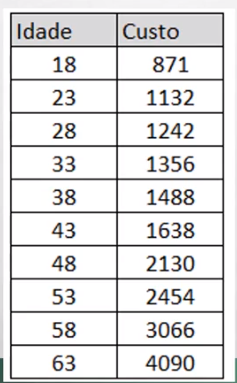

* Existe uma relação matemática entre estas duas variáveis?
* Se existe, como posso medir sua força?
* Poderia usar essa relação para fazer previsões?

Gráfico de Dispersão
* Representação gráfica mais tradicional para variáveis númericas e trabalhar com regrassão linear.

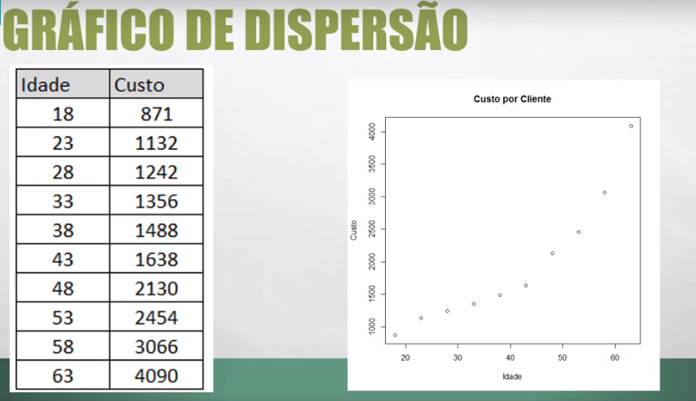

Plano Cartesiano
* Eixo Y (Vertical) - Variável de Resposta ou Dependente.
* Eixo X (Horizontal) - Variável Explanatória ou Independente.

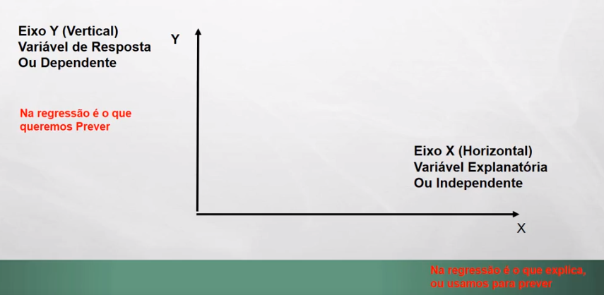

Regrassão Linear
* Existe uma certa linearidade entre as variáveis Dependente e Independente.
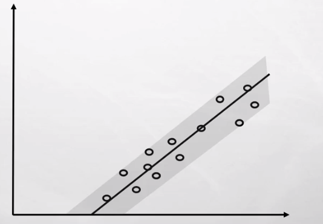

<h2>Correlação [R]</h2>
* Mostra a força e a direção da relção entre variáveis.
* Pode ser um valor entre -1 e 1.
* A correção de A ~ B é a mesma que B ~ A.

Força e Direção
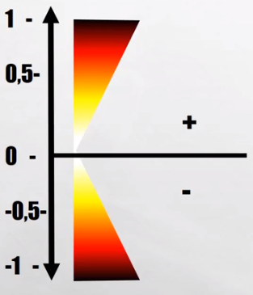
* Quanto mais próximo de 0, mais a correlação é fraca.
* Quanto mais aos extremos mais forte é a correlação.
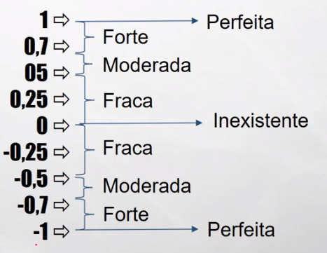


Correlação Forte e Fraca
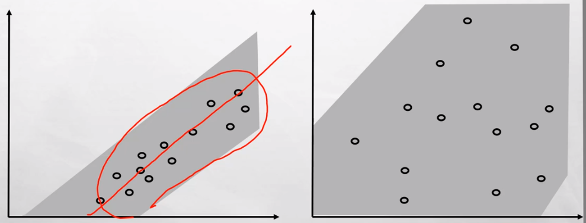

Correção Positiva e Negativa
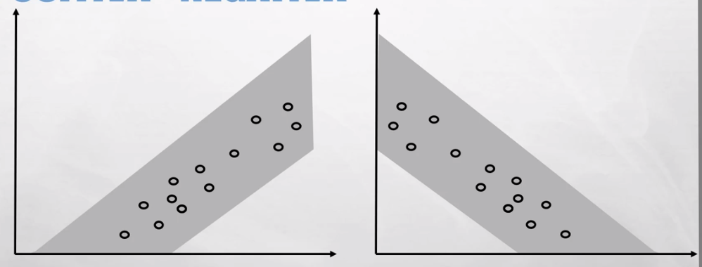

Coeficiente de Determinação [R^2]
* Mostra o quanto o modelo consegue explicar os valores.
* Quanto maior, mais explicativo ele é.
* O restante da variabilidade está em variáveis não incluídas no modelo.
* Varias entre zero até 1 (sempre positivo).
* Calcula-se com o quadrado do coeficiente de correção [R].
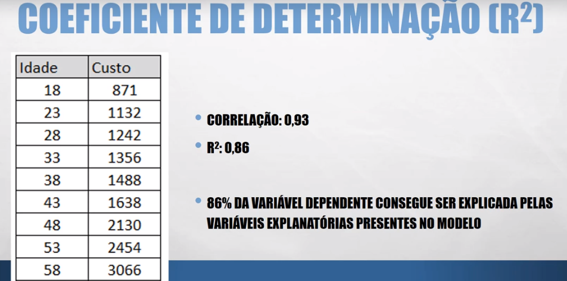

<h2>Regressão Linear - Previsão</h2>
* Ex: Qual vai ser o custo de um cliente com 45 anos de idade?
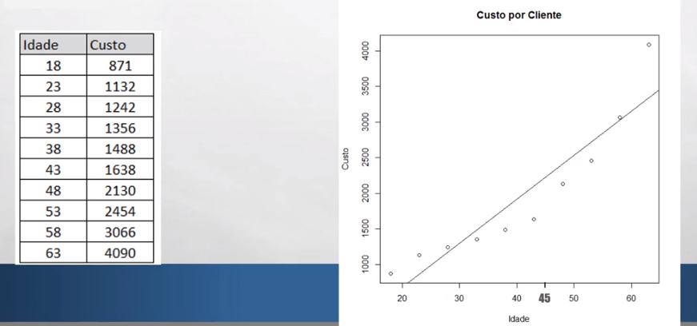

Como a Linha de melhor ajuste é construída?
* Ponto de Encontro da Linha no Eixo Y (interseção):  X = 0.
* Inclinação: a cada unidade que aumenta a variável Independente (x), a variável de resposta (y) sobe o valor da inclinação.
* Planilhas e Ferramentas Estatísticas calculam estes valores automaticamente.
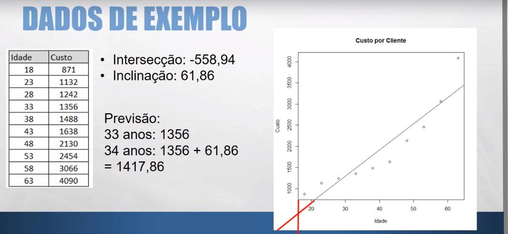

Como fazer a previsão de um valor através da regressão linear?
* Previsão = Intersecção + (inclinação * valor a prever).
* Quanto vai custar um cliente com 56 anos de idade?
	* X = -558,94 + (61,86 * 56).
	* X = 2905,22.
* Qualquer software executa o cálculo automaticamente.

<h2>Regressão Linear - Residuais</h2>
* Anteriormente foi visto a linha da intersecção para prever valores.
* Nesse exemplo abaixo, nenhumm coincide com a linha de regressão, sendo um ajuste criado a partir dos dados fornecidos.
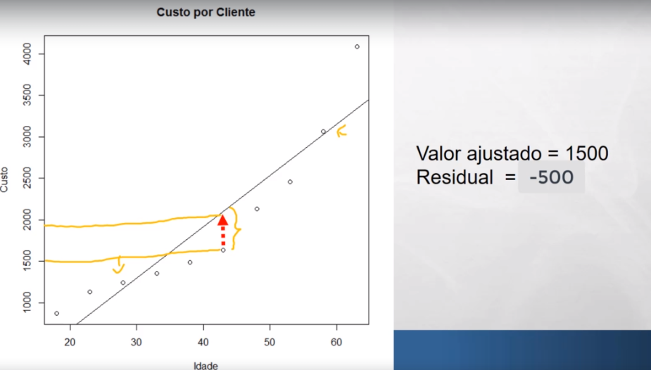
* O resíduo é o valor do qual se localiza o dado até a linnha de regressão.
* Se a variável estiver acima da linha de regressão seu valor é positivo, se abaixo, seu valor é negativo e se coincidir seu valor é 0.

<h2>Regressão Linear: Outliers - Extrapolação - Correlação não é causa</h2>
Outliers
* Conceito estatístico que se refere a valores fora do padrão, fugindo do padrão dos dados.
* Existem várias técnicas que encontram outliers.
* Como outliers podem estragar nosso modelo:
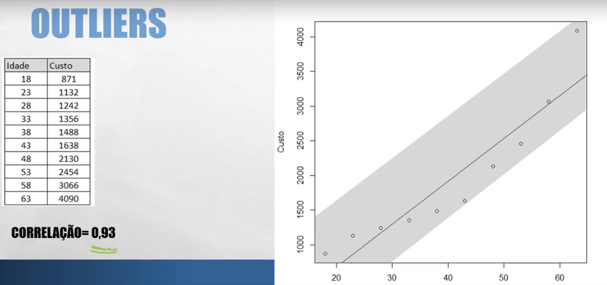

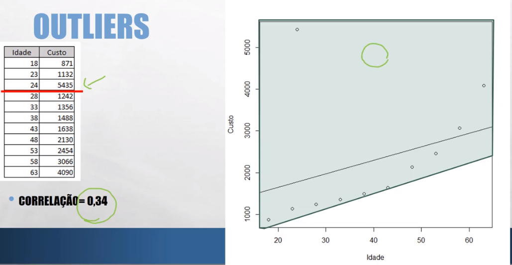

* A área de regrassão ficou muito maior.
* O que se deve fazer? Depende da sua avaliação, se deve retirar ou reavaliar o dado.


Extrapolação
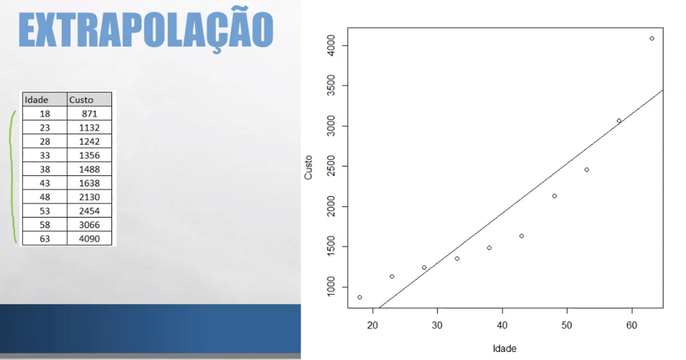
* Não sabemos como os dados irão se comportar.
* Não faz sentido analisar qual o custo de uma pessoa de 140 anos por exemplo.
* A reta no gráfico pode mudar.

Correção não é causa
* Pessoas com mais treinamento tem melhor performance ou será que:
	* Elas receberam treinamento porque performaram melhor?

* Candidatos vistos como carismáticos obtém mais votos, ou será que:
	* Candidatos mais votados são vistos como carismáticos?

<h2>Regressão Linear Simples com R</h2>

```r
#cars É UM CONJUNTO DE DADOS QUE VEM NO R
#DO QUAL POSSUEM DUAS VARIÁVEIS (VELICIDADE E DISTÂNCIA)
cars
#MOSTRA QUANTIDADE DE DADOS E QUANTAS VARIÁVEIS
dim(cars)

#CORRELAÇÃO ENTRE AS VARIÁVEIS (É FORTE)
cor(cars)

modelo = lm(speed ~ dist, data = cars)

modelo

#MOSTRA GRÁFICOS RELACIONADOS AO MODELO
plot(modelo)

#CRIA O GRÁFICO CARTEZIANO COM SPEED NO Y E DIST NO X
plot(speed ~ dist, data = cars)
#MOSTRA A RETA NO GRÁFICO
abline(modelo)

#FAZ A PREVISÃO COM A VELOCIDADE DE 22, FAZENDO O CÁLCULO NA "MÃO"
modelo$coefficients[1] + modelo$coefficients[2] * 22

#FAZ A MESMA COISA QUE A LINHA DE CIMA
predict(modelo, data.frame(dist=50))

summary(modelo)

#REAJUSTES DOS RESIDUAIS
modelo$residuals

#VALORES AJUSTADOS
#SÃO OS DADOS PARA FAZER O MODELO DE MELHOR AJUSTE
plot(modelo$fitted.values, cars$dist)

```


```r
> cars
   speed dist
1      4    2
2      4   10
3      7    4
4      7   22
5      8   16
6      9   10
7     10   18
8     10   26
9     10   34
10    11   17
11    11   28
12    12   14
13    12   20
14    12   24
15    12   28
16    13   26
17    13   34
18    13   34
19    13   46
20    14   26
21    14   36
22    14   60
23    14   80
24    15   20
25    15   26
26    15   54
27    16   32
28    16   40
29    17   32
30    17   40
31    17   50
32    18   42
33    18   56
34    18   76
35    18   84
36    19   36
37    19   46
38    19   68
39    20   32
40    20   48
41    20   52
42    20   56
43    20   64
44    22   66
45    23   54
46    24   70
47    24   92
48    24   93
49    24  120
50    25   85
> dim(cars)
[1] 50  2
> cor(cars)
          speed      dist
speed 1.0000000 0.8068949
dist  0.8068949 1.0000000
> modelo = lm(speed ~ dist, data = cars)
> modelo

Call:
lm(formula = speed ~ dist, data = cars)

Coefficients:
(Intercept)         dist  
     8.2839       0.1656  

> plot(modelo)
Esperando para confirmar mudança de página...
Esperando para confirmar mudança de página...
Esperando para confirmar mudança de página...
Esperando para confirmar mudança de página...
> plot(modelo)
Esperando para confirmar mudança de página...
Esperando para confirmar mudança de página...
Esperando para confirmar mudança de página...
Esperando para confirmar mudança de página...
> plot(speed ~ distancia, data = cars)
Error in eval(predvars, data, env) : objeto 'distancia' não encontrado
> plot(speed ~ dist, data = cars)
> abline(modelo)
Error in int_abline(a = a, b = b, h = h, v = v, untf = untf, ...) : 
  plot.new has not been called yet
> abline(modelo)
Error in int_abline(a = a, b = b, h = h, v = v, untf = untf, ...) : 
  plot.new has not been called yet
> plot(speed ~ dist, data = cars)
> abline(modelo)
> modelo$coeficients
NULL
> modelo$coefficients
(Intercept)        dist 
  8.2839056   0.1655676 
> modelo$coefficients[1] + modelo$coefficients[2] * 22
(Intercept) 
   11.92639 
> predict(modelo, data.frame(dist=22))
       1 
11.92639 
> predict(modelo, data.frame(dist=50))
       1 
16.56228 
> summary(modelo)

Call:
lm(formula = speed ~ dist, data = cars)

Residuals:
    Min      1Q  Median      3Q     Max 
-7.5293 -2.1550  0.3615  2.4377  6.4179 

Coefficients:
            Estimate Std. Error t value Pr(>|t|)    
(Intercept)  8.28391    0.87438   9.474 1.44e-12 ***
dist         0.16557    0.01749   9.464 1.49e-12 ***
---
Signif. codes:  0 ‘***’ 0.001 ‘**’ 0.01 ‘*’ 0.05 ‘.’ 0.1 ‘ ’ 1

Residual standard error: 3.156 on 48 degrees of freedom
Multiple R-squared:  0.6511,    Adjusted R-squared:  0.6438 
F-statistic: 89.57 on 1 and 48 DF,  p-value: 1.49e-12

> modelo$residuals
          1           2           3           4           5           6 
-4.61504079 -5.93958139 -1.94617594 -4.92639228 -2.93298684 -0.93958139 
          7           8           9          10          11          12 
-1.26412199 -2.58866258 -3.91320318 -0.09855441 -1.91979773  1.39814831 
         13          14          15          16          17          18 
 0.40474287 -0.25752743 -0.91979773  0.41133742 -0.91320318 -0.91320318 
         19          20          21          22          23          24 
-2.90001408  1.41133742 -0.24433833 -4.21796012 -7.52931161  3.40474287 
         25          26          27          28          29          30 
 2.41133742 -2.22455467  2.41793197  1.09339137  3.41793197  2.09339137 
         31          32          33          34          35          36 
 0.43771563  2.76225622  0.44431018 -2.86704131 -4.19158191  4.75566167 
         37          38          39          40          41          42 
 3.09998592 -0.54250072  6.41793197  3.76885078  3.10658048  2.44431018 
         43          44          45          46          47          48 
 1.11976958  2.78863443  5.77544533  4.12636413  0.48387749  0.31830992 
         49          50 
-4.15201460  2.64285051 
> modelo$fitted.values
        1         2         3         4         5         6         7         8 
 8.615041  9.939581  8.946176 11.926392 10.932987  9.939581 11.264122 12.588663 
        9        10        11        12        13        14        15        16 
13.913203 11.098554 12.919798 10.601852 11.595257 12.257527 12.919798 12.588663 
       17        18        19        20        21        22        23        24 
13.913203 13.913203 15.900014 12.588663 14.244338 18.217960 21.529312 11.595257 
       25        26        27        28        29        30        31        32 
12.588663 17.224555 13.582068 14.906609 13.582068 14.906609 16.562284 15.237744 
       33        34        35        36        37        38        39        40 
17.555690 20.867041 22.191582 14.244338 15.900014 19.542501 13.582068 16.231149 
       41        42        43        44        45        46        47        48 
16.893420 17.555690 18.880230 19.211366 17.224555 19.873636 23.516123 23.681690 
       49        50 
28.152015 22.357149 
> plot(modelo$fitted.values)
> plot(modelo$fitted.values)
> plot(modelo$fitted.values)
> plot(modelo$fitted.values, cars$dist)

```

<h2>Correlação</h2>
* Moderada ou forte

